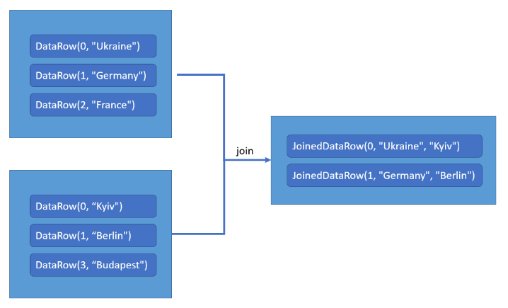
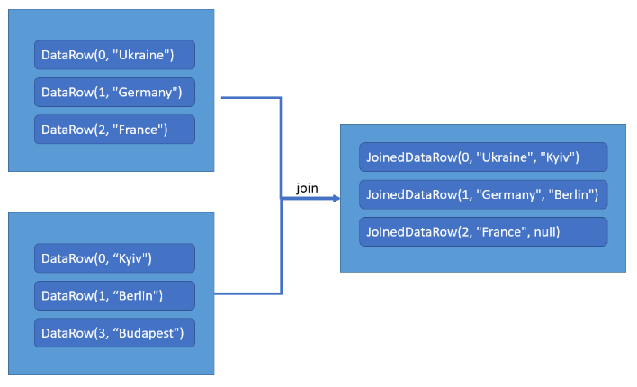
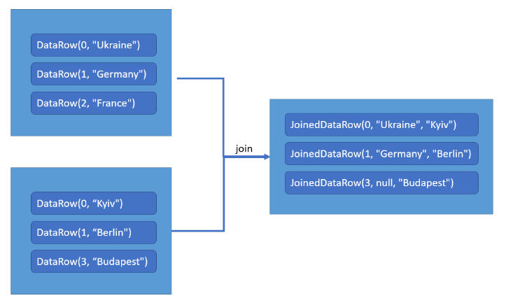

## Inner join
### Description
Inner join is a set operation that combines two sets by matching one or more columns from each set. The result of an inner join is a new set that contains only the rows that match in both sets. The inner join is the most common type of join.
### Example

## Left outer join
### Description
Left outer join is a set operation that combines two sets by matching one or more columns from each set. The result of a left outer join is a new set that contains all the rows from the left set and any matching rows from the right set. If there are no matching rows in the right set, the result set will contain null values in the columns from the right set.
### Example

## Right outer join
### Description
Right outer join is a set operation that combines two sets by matching one or more columns from each set. The result of a right outer join is a new set that contains all the rows from the right set and any matching rows from the left set. If there are no matching rows in the left set, the result set will contain null values in the columns from the left set.
### Example
